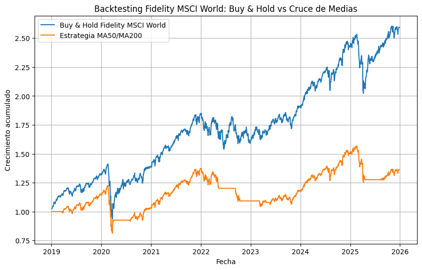
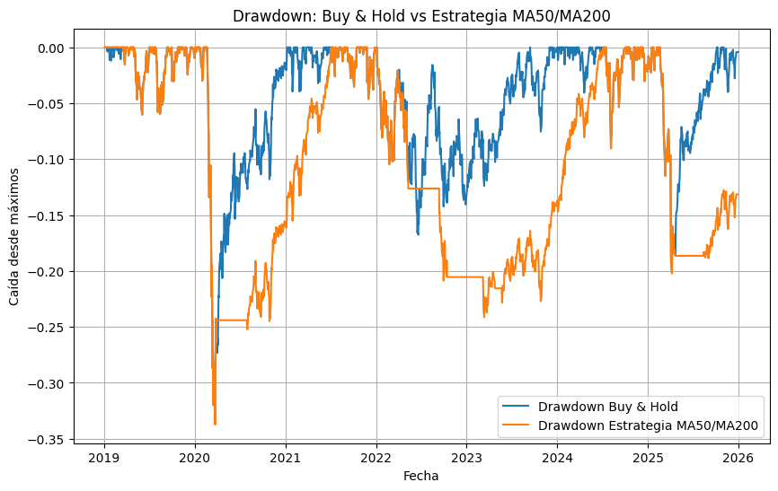

# Backtesting de una estrategia MA50/MA200 sobre Fidelity MSCI World

## Introducción

La inversión indexada es una de las estrategias más populares entre los inversores debido a su simplicidad y a sus buenos resultados históricos.

En este proyecto analizo si una estrategia basada en el cruce de medias móviles de 50 y 200 días habría mejorado los resultados de una inversión pasiva en el fondo Fidelity MSCI World Index EUR P Acc.

## Objetivo

Comparar el rendimiento de dos estrategias:

### Estrategia 1: Buy & Hold

- Invertir en el Fidelity MSCI World Index EUR P Acc.
- Mantener la inversión durante todo el periodo analizado.
- No realizar cambios en la cartera.

### Estrategia 2: Cruce de medias móviles (MA50/MA200)

- Invertir cuando la media móvil de 50 días sea superior a la de 200 días.
- Salir del mercado cuando la media móvil de 50 días sea inferior a la de 200 días.

## Datos utilizados

- Fondo: Fidelity MSCI World Index EUR P Acc
- Ticker Yahoo Finance: `0P0001CLDK.F`
- Fuente: Yahoo Finance mediante `yfinance`
- Periodo analizado: 2019-2025

## Resultados

| Métrica | Buy & Hold | MA50/MA200 |
|----------|------------|------------|
| Rentabilidad | 159.39% | 36.24% |
| Volatilidad | 16.59% | 14.33% |
| Sharpe Ratio | 0.90 | 0.38 |
| Máx. Drawdown | -33.71% | -33.71% |

## Conclusiones

Durante el periodo analizado, la estrategia Buy & Hold superó claramente a la estrategia basada en el cruce de medias móviles de 50 y 200 días.

Aunque la estrategia MA50/MA200 redujo ligeramente la volatilidad, obtuvo una rentabilidad significativamente inferior y no consiguió mejorar la máxima caída sufrida por la cartera.

Los resultados indican que, para el Fidelity MSCI World Index Fund y el periodo analizado, mantenerse invertido de forma continua resultó más eficiente que seguir una estrategia basada en el cruce de medias móviles.

Este análisis coincide con una de las ideas fundamentales de la inversión indexada: el tiempo en el mercado suele ser más importante que intentar acertar el momento de entrada y salida.
## Evolución de la inversión

## Drawdown

## Estructura del repositorio

- `msci-world-backtesting.py`: implementación del backtesting y cálculo de métricas de rendimiento.
- `backtest.png`: comparación de la evolución acumulada de ambas estrategias.
- `drawdown.png`: comparación de las caídas máximas de ambas estrategias.

## Tecnologías utilizadas

- Python
- Pandas
- NumPy
- Matplotlib
- yfinance
